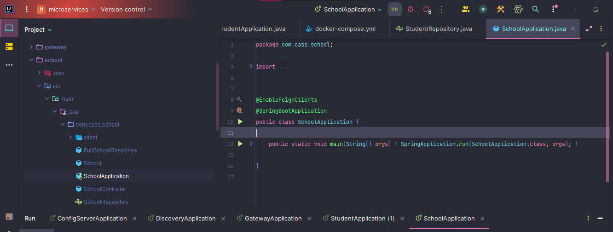
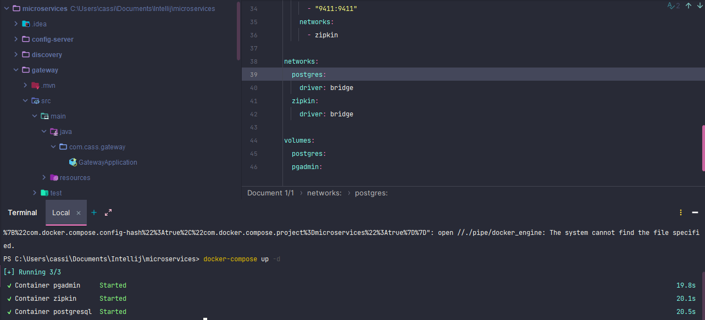
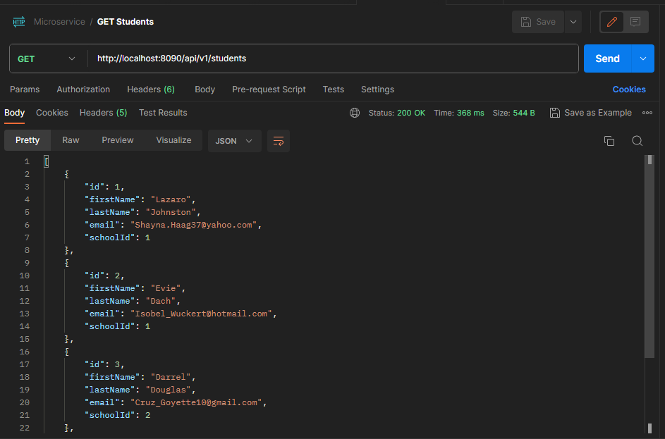
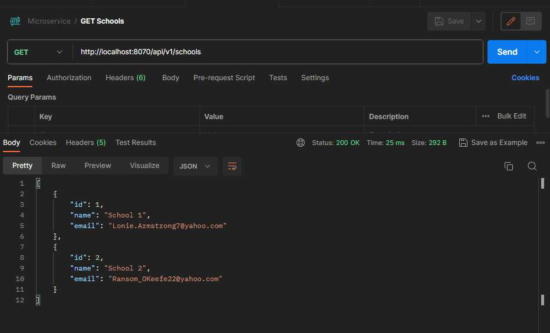
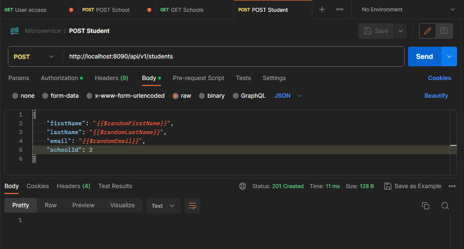
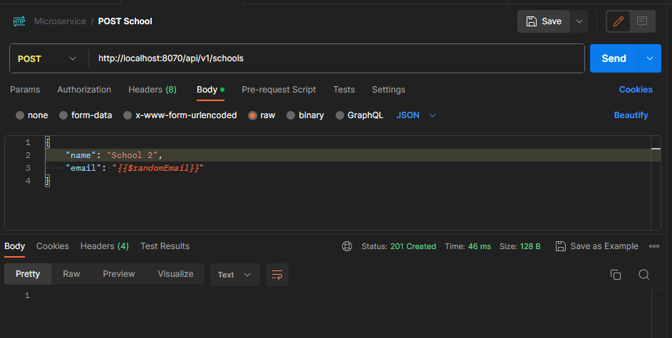
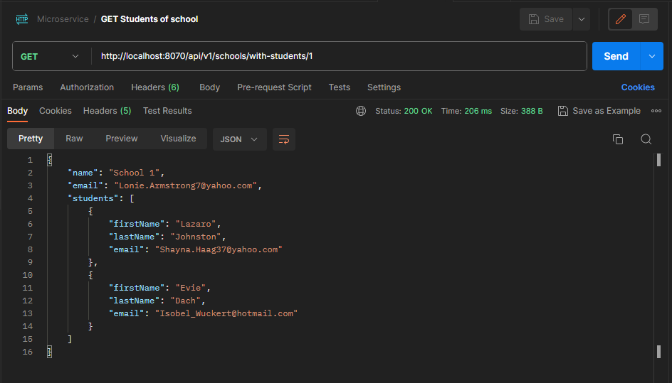
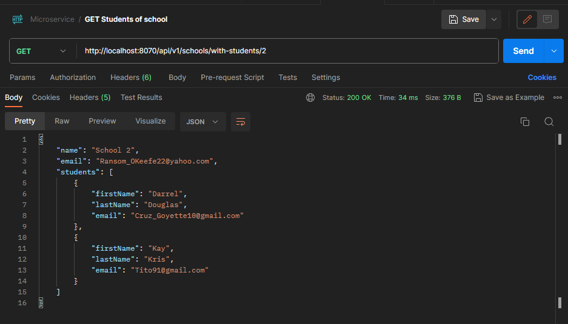
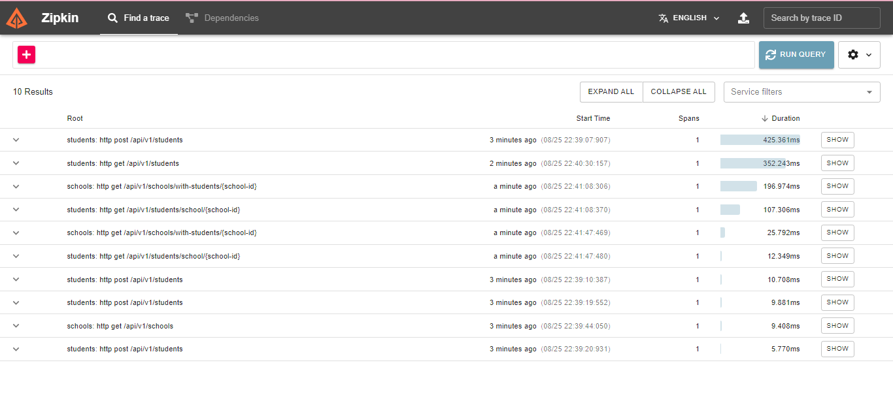
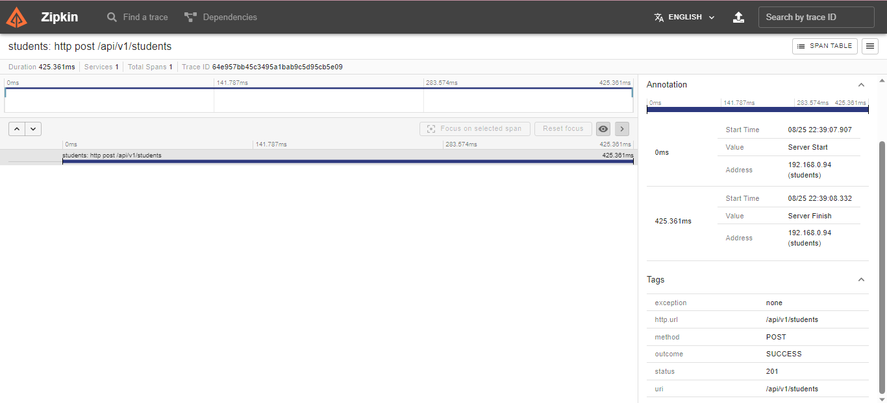

<h1 align="center"> Microservices </h1>
<p align="center">
  <a href="#-tecnologies">Tecnologies</a>&nbsp;&nbsp;&nbsp;|&nbsp;&nbsp;&nbsp;
  <a href="#-project">Project</a>&nbsp;&nbsp;&nbsp;|&nbsp;&nbsp;&nbsp;
  <a href="#memo-license">License</a>
  <p align="center">
  
</p>
</p>

<br>

## 🚀 Tecnologies

This project was developed with the following technologies:

- Java & Spring Boot 🍃
- Postgres 🐘
- Postman
- Docker 🚢
- Git & Github
- Zipkin

 <br>

## 💻 Project

This project contains a microservice structure for CRUD endpoints using a school and students interaction. In this architecture we have the decoupling of the application, 
facilitating the maintenance and scalability of the project, which despite being simple reveals great advantages of using microservices instead of monolithic system.

<br>

## :memo: License


This project is under license from MIT

<br>

## Run application
<p>To use the endpoints, ensure that all microservices are running </p>

<p align="center">
  
</p>

<p>Same to docker container</p>
<p align="center">
  
</p>

<br>

## Endpoints 
<p>To test the application endpoints you can use the Postman, HttpPie, Insomnia...</p>

<br>

### Get all students
 - <p> To fetch all students, you'll use: </p>
<p align="center">

  ```
  https://localhost:8090/api/v1/students
  ```
  
  
</p>

<br>

### Get all schools
 - <p> To fetch all schools, you'll use: </p>
<p align="center">

  ```
  https://localhost:8070/api/v1/schools
  ```
  
  
</p>

<br>

### Post students
 - <p> To post students, you'll use the JSON format and the endoint below </p>
<p align="center">
 
  ```
  https://localhost:8090/api/v1/students

{
    "firstName": "{{$randomFirstName}}",
    "lastName": "{{$randomLastName}}",
    "email": "{{$randomEmail}}",
    "schoolId": 2
}
  ```
  
  
</p>

<br>

### Create schools
 - <p> To create schools, you'll use the JSON format and the endoint below </p>
<p align="center">

  ```
  https://localhost:8070/api/v1/scholls
{
    "name": "School 1",
    "email": "{{$randomEmail}}"
}
```

  
</p>

<br>

### Get student from school
 - <p> The school side interacts with the student side, fetching the data of students from a pre-selected school </p>
 <p align="center">
  
  ```
  http://localhost:8070/api/v1/schools/with-students/1
  ```
  
  
  
</p>

<br> 

### Monitoring the app performance with zipkin
 - <p> In zipkin port, you can view all the logs </p>
 
 <p align="center"> 
  
  
</p>

<p>Thanks for your attention, see you next time 💜</p>

